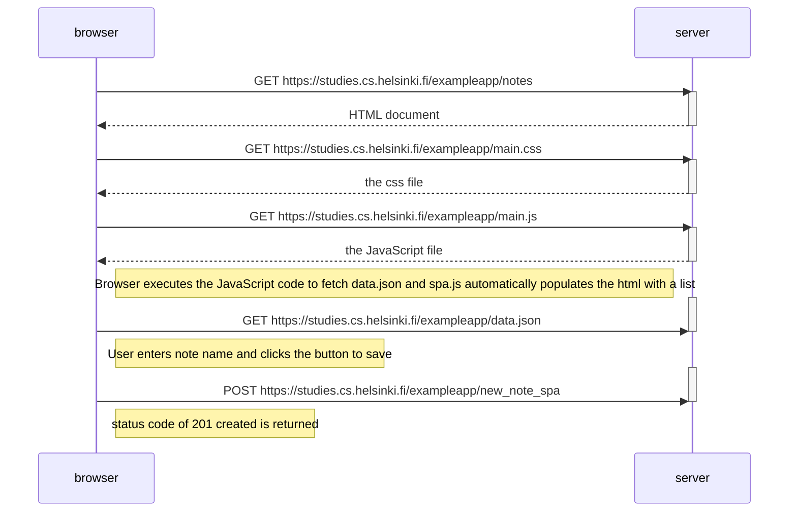

```mermaid
sequenceDiagram
    participant browser
    participant server

    browser->>server: GET https://studies.cs.helsinki.fi/exampleapp/notes
    activate server
    server-->>browser: HTML document
    deactivate server

    browser->>server: GET https://studies.cs.helsinki.fi/exampleapp/main.css
    activate server
    server-->>browser: the css file
    deactivate server

    browser->>server: GET https://studies.cs.helsinki.fi/exampleapp/main.js
    activate server
    server-->>browser: the JavaScript file
    deactivate server

    Note right of browser: Browser executes the JavaScript code to fetch data.json and spa.js automatically populates the html with a list
    activate server
    browser->>server: GET https://studies.cs.helsinki.fi/exampleapp/data.json
    deactivate server
    Note right of browser: User enters note name and clicks the button to save
    activate server
    browser->>server: POST https://studies.cs.helsinki.fi/exampleapp/new_note_spa
    deactivate server
    Note right of browser: status code of 201 created is returned
    
```
